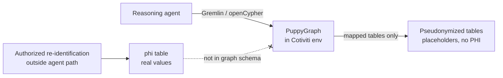

# PuppyGraph — Security and PHI Handling (SI Track, Cotiviti CCV POC)

Sep 22, 2026 · PuppyGraph + Quark Labs

## Submission declaration

| Field | Value |
| --- | --- |
| Vendor name | PuppyGraph (retrieval layer), with Quark Labs (data preparation) |
| Vendor track | Solution Integrator |
| Opt-in declaration | I am opting into the Solution Integrator track |
| Integration targets | MCP-compatible agent frameworks; Java, Python, Go and JavaScript client drivers; CSV, Parquet, Iceberg and Hive exports (see [INTEGRATION API SURFACE](/sandbox/biomedical_rag/round_2/vendor_puppygraph_solution_integrator_track/vendor_puppygraph_stage2_si_api_integration.md)) |
| Submission round | Round 2 (Blind) |

## Summary

PHI never reaches the reasoning agent through PuppyGraph. Every personal identifier in the POC data has been replaced with a placeholder, the real values sit in a single `phi` table, and that table is not mapped into the graph schema, so no graph query can return it.

PuppyGraph also adds no new place for PHI to live. It is software that runs inside Cotiviti's own environment, queries data where it already sits, and sends nothing back to PuppyGraph. Encryption, network isolation and access control are therefore the ones Cotiviti already applies to its data stores.

This document answers the Security / PHI handling gate in Section 3.0.a of the Cotiviti CCV Agentic AI brief (August 2026) and the "Security and PHI handling documentation" output in Section 2.2.

## Deployment model

PuppyGraph is deployed and operated inside the customer's environment. It is not a SaaS product and there is no PuppyGraph-hosted component in the data path.

- **On-premise / customer VPC.** PuppyGraph runs on infrastructure Cotiviti controls, beside the data stores it reads.
- **No telemetry.** No usage data, query text, results or logs are sent to PuppyGraph the company.
- **No data movement.** PuppyGraph queries tables in place through their existing connectors. There is no ETL into a separate graph database and no copy of the records held by PuppyGraph.
- **No PuppyGraph access.** PuppyGraph staff have no standing access to the deployment or the data. Any support session happens only on Cotiviti's terms and through Cotiviti's own access controls.

The agent reaches only the tables mapped into the graph schema; the `phi` table has no route through PuppyGraph.

## Third-party processor: OpenAI API

On the Solution Integrator track, the reasoning pipeline sends retrieved text to the OpenAI API for retrieval and judge calls. This is the only point where record content leaves Cotiviti's environment.

| Processor | Calls | What is sent | What is never sent |
| --- | --- | --- | --- |
| OpenAI API | Retrieval and judge calls | Retrieved passages and claim context, with identifiers already replaced by placeholders | The `phi` table or any real identifier value |

Pseudonymization happens before retrieval, so OpenAI receives no names, MRNs, dates of birth or other listed identifiers. Dates of service and ages remain in the text, as they do throughout the pseudonymized data. Calls to the API are encrypted in transit with TLS.

OpenAI is the POC's choice of model, not a requirement. PuppyGraph lets you configure the model endpoint, as long as it is OpenAI-compatible or Anthropic-compatible. Separately and independently, Quark Labs supports setting up Cotiviti's choice of models in its own pipeline, including models hosted inside Cotiviti's environment. Once deployed, every model call can follow Cotiviti's own rules on AI usage, and no record content has to leave Cotiviti's control.

## Inherited data security

Because PuppyGraph reads data where it is stored, the data's security posture is the one Cotiviti already has. PuppyGraph does not weaken it and does not need a parallel set of controls.

- **Encryption at rest** is provided by the underlying storage (object store, lakehouse table format or database) under Cotiviti's keys and key management.
- **Encryption in transit, source side.** The hop between PuppyGraph and each data source uses the TLS settings of that source's connector.
- **Encryption in transit, agent side.** PuppyGraph supports TLS on all three client endpoints (Gremlin over WSS, openCypher over Bolt with TLS, and the Web UI over HTTPS) by running behind an Nginx TLS proxy with TLS 1.2/1.3. SNI routing lets all three share one port, 443 ([PuppyGraph docs](https://docs.puppygraph.com/getting-started/sni-tls-nginx/)).
- **Endpoint authentication.** Username/password authentication can be enabled on the Gremlin and Bolt servers, so an unauthenticated client cannot query the graph even inside the network.
- **Source access control** stays authoritative. PuppyGraph connects with a credential Cotiviti issues, and it can read only what that credential's grants allow.
- **Network isolation** follows Cotiviti's existing segmentation. PuppyGraph needs no inbound path from the internet and no outbound path to PuppyGraph.

The practical consequence: any control Cotiviti's security review already accepts for the source tables applies unchanged to what PuppyGraph serves.

## PHI isolation at the retrieval layer

No table the agent can read through PuppyGraph holds a personal identifier. Quark Labs pseudonymized the POC data before it was mapped: 598 distinct identifier values, printed at 29,919 places, were each replaced by a placeholder.

### What was replaced

Scope follows the HIPAA identifier list: names, MRNs, dates of birth, phone numbers, street addresses, and account, claim, member, authorization, group, incident and accession numbers. Dates of service and ages are kept, so the result is a HIPAA limited data set rather than Safe Harbor de-identification. Reviewers need those dates to judge readmission windows and per-diem days; no age in the data exceeds 89.

Identifiers are found by five deterministic rules, and each replacement records which rule caught it:

1. The value of a field whose label names an identifier (Patient, MRN, Date of Birth, Member ID, Phone, Address and similar).
2. The patient fields of the claim files.
3. Any string in the same form as a known value (once `MRN-` plus seven digits is an MRN, every string of that shape is one).
4. A person named beside a relationship word, such as a daughter or spouse.
5. A date equal to that patient's date of birth, in any format.

### What the agent sees instead

Each value becomes a typed placeholder, and the same value always becomes the same placeholder. For example, `patient_name [[NAME-0046]]`, `patient_mrn [[MRN-0046]]`, `claim_member_id [[MEMBER-0016]]`. Row ids that used to embed account numbers, MRNs or birth dates were rebuilt as `VISIT-017`, `PT-012` and so on.

This keeps retrieval useful without exposing identity. The agent can still confirm that a claim and a record refer to the same patient, or spot one MRN carrying two birth dates. Page numbers and document references are untouched, so citation fidelity (Section 3.0.a) is not affected.

### Where the real values live

All real values sit in one table, `phi`, in its own namespace. Each row maps a placeholder back to its value and records the source table, row, column, occurrence, detecting rule, source file and page.

The `phi` table is not mapped into the PuppyGraph graph schema and is excluded from the JSON exports. PuppyGraph can only traverse vertices and edges defined in its schema, so there is no query an agent can issue through PuppyGraph that returns a `phi` row. Re-identification for a human reviewer happens outside the agent path, by joining on table, row, column and occurrence.

### How it is verified

These checks run on every build, and the build stops if any fails.

| Check | Result |
| --- | --- |
| Every table rebuilt from placeholders plus `phi`, compared row for row | 2,756,639 of 2,756,639 rows identical |
| Every shipped file scanned for any value in `phi` | 0 found |
| Same scan run before replacement, as a control | about 10 million found |
| Rows still holding an identifier where the rules say one stands | 0 |

### Known residual

Two kinds of text are left in place by design: 32 staff names that share a patient's surname and appear elsewhere with a credential (RN, MD, LPN), and 93 facility phone numbers. An identifier never printed under a label and never matching a known value, such as a relative named once in a nursing note, could survive the rules. The POC records are synthetic and marked as fictional, but were handled as if real.

## Access control and audit logging

In the POC, the graph schema keeps PHI away from the agent: it does not expose `phi`. Storage-level grants can add a second, independent barrier in production.

- **Least-privilege source credential.** For production, the credential PuppyGraph uses can be limited to read grants on the pseudonymized tables only, and no grant on the `phi` namespace. Then even a mis-edited schema could not surface PHI. The POC relies on exclusion of the phi table from the schema mapping alone.
- **Separate re-identification role.** Only the human-review workflow holds read access to `phi`, under a different identity from PuppyGraph and the agent.
- **Read-only retrieval.** The agent's queries through PuppyGraph are reads; PuppyGraph does not write back to the source tables.
- **Audit trail.** Access to the source tables, including every read of `phi`, is logged by the storage platform's own audit logs, which Cotiviti already retains and reviews. PuppyGraph's service logs stay on Cotiviti's infrastructure and can be shipped to Cotiviti's SIEM. Each `phi` row also records the rule and source page behind it, so any replacement can be audited back to the original record.

## Shared responsibility

| Control | Cotiviti | PuppyGraph | Quark Labs |
| --- | --- | --- | --- |
| Hosting, network, OS hardening | Owns | Provides deployment guidance | — |
| Encryption at rest and keys | Owns (storage layer) | Inherits | — |
| Encryption in transit | Owns source and network TLS | Uses source connector TLS | — |
| Source credentials and grants | Issues and scopes | Uses as issued | — |
| Graph schema (what is traversable) | Approves | Enforces | Authors; excludes `phi` |
| PHI pseudonymization | Accepts | — | Owns; build-time checks |
| `phi` table access | Owns (review role only) | No schema path | Produces the table |
| Audit logs | Retains and reviews | Emits service logs locally | Records rule and source per value |
| Telemetry to vendor | — | None sent | None sent |
| Third-party processor (OpenAI API) | Chooses the model endpoint under its AI usage rules | Returns placeholder text only | Pseudonymizes before any call |

## Answers to Section 3.0.a

| Cotiviti question | Answer |
| --- | --- |
| How is PHI protected at the retrieval layer? | Identifiers are replaced by placeholders before mapping. The `phi` table is outside the graph schema, so no retrieval through PuppyGraph returns PHI. |
| Is data encrypted at rest and in transit? | Yes. At rest by Cotiviti's own storage; PuppyGraph stores no copy of the data. In transit, TLS 1.2/1.3 is supported on every agent-facing endpoint (Gremlin WSS, Bolt TLS, HTTPS) and over each source connector's TLS. |
| Is there audit logging? | Yes. Storage-platform audit logs cover every table read, including `phi`. PuppyGraph logs stay in Cotiviti's environment, and each `phi` row traces to its rule and source page. |
