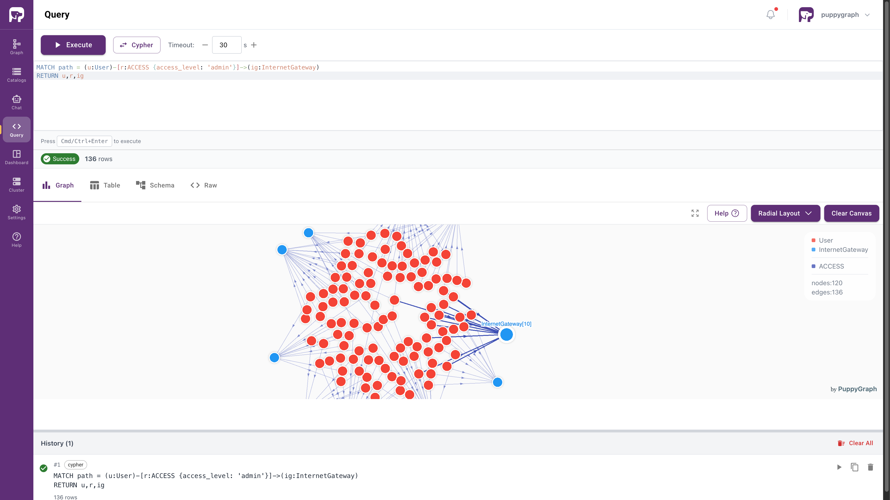
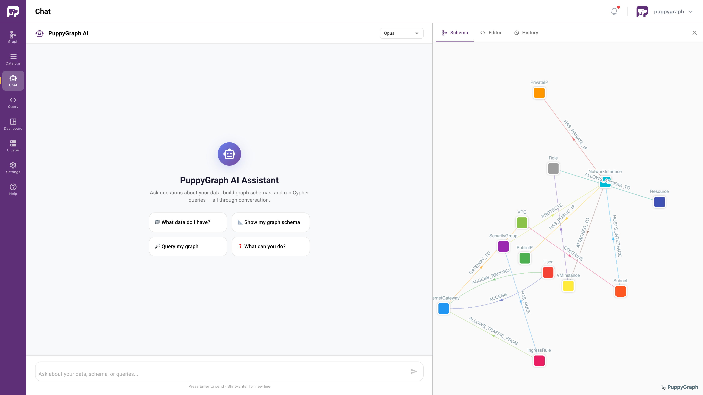
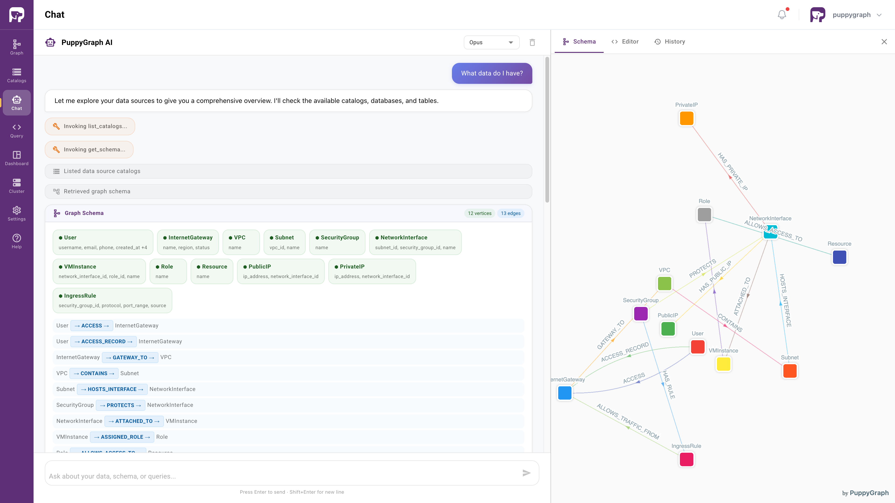
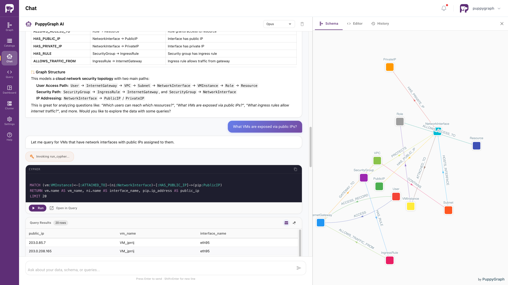
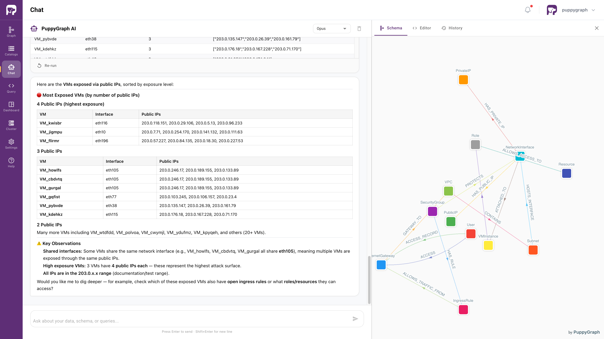

# PuppyGraph on Google Cloud Lakehouse: Ontology Enforcement for the Open Lakehouse

> **Note:** Google Cloud Lakehouse was formerly known as **BigLake**, and the Lakehouse runtime catalog was formerly known as the **BigLake Metastore**. Some API endpoints, IAM role names, and Google Cloud documentation URLs still use the legacy `biglake` identifier during the rebranding transition.

## Summary

This demo showcases how PuppyGraph connects directly to Google Cloud Lakehouse Iceberg tables to provide an enforced ontology layer that AI agents can rely on for accurate query generation and self-correction.

Using a synthesized **cloud security network** dataset, the demo models infrastructure entities (users, VPCs, subnets, security groups, VMs, etc.) and their relationships as a graph. PuppyGraph acts as a machine-readable ontology that:

- Tells AI agents what entities exist, how they relate, and what properties they carry.
- Validates every query against the schema, returning structured errors when an agent references invalid entity types or relationships.
- Provides feedback for a self-correcting loop where agents can diagnose and fix their own mistakes.

PuppyGraph also includes a built-in AI agent that leverages this ontology natively, enabling natural language questions to be answered directly over the graph.

## Architecture

```
          AI Agents
              |
         PuppyGraph            Apache Spark
      (Ontology Layer)       (Data Ingestion)
              |                     |
              +----------+----------+
                         |
               Lakehouse Runtime Catalog
                  (Iceberg REST Catalog)
                         |
                  Google Cloud Storage
                  (Iceberg Data Files)
```

- **Data storage**: Google Cloud Storage via Google Cloud Lakehouse Iceberg tables
- **Catalog**: Lakehouse runtime catalog with Iceberg REST Catalog API
- **Authentication**: GoogleAuthManager with service account key files
- **Data ingestion**: Apache Spark with Iceberg + GCP bundle
- **Ontology Layer**: PuppyGraph

## Prerequisites

Please ensure that `docker` is available. The installation can be verified by running:

```bash
docker --version
```

You also need:

- A Google Cloud project with BigLake API enabled.
- A GCS bucket and a Lakehouse runtime catalog with the end-user credential mode. See [Create a Lakehouse Iceberg REST catalog](https://docs.cloud.google.com/biglake/docs/blms-rest-catalog) for instructions. Note that you just need to create the catalog without creating any tables, as the demo will create sample tables for you.
- A service account with the following roles:
  - `roles/biglake.editor` ([BigLake Editor](https://cloud.google.com/biglake/docs/access-control#biglake.editor)) on the project
  - `roles/storage.objectUser` ([Storage Object User](https://cloud.google.com/storage/docs/access-control/iam-roles#standard-roles)) on the Cloud Storage bucket
  - `roles/serviceusage.serviceUsageConsumer` ([Service Usage Consumer](https://cloud.google.com/service-usage/docs/access-control#roles)) on the project

  Authentication uses [Application Default Credentials (ADC)](https://cloud.google.com/docs/authentication/application-default-credentials). On a GCP VM with an attached service account that has the roles above, ADC works automatically with no additional setup. Outside of GCP, download the service account key file and set `GOOGLE_APPLICATION_CREDENTIALS` as shown in the Data Preparation section.
- Python 3.9+ installed locally, used for setting up the data preparation environment.
- An [Anthropic API key](https://console.anthropic.com/) for PuppyGraph's built-in AI agent assistant. A [Tier 2](https://platform.claude.com/docs/en/api/rate-limits#tier-2) usage tier or above is recommended for sufficient input tokens per minute (ITPM).

> **Note:** For production (read-only) use, `roles/biglake.viewer` (BigLake Viewer) and `roles/storage.objectViewer` (Storage Object Viewer) are sufficient for PuppyGraph to read the data. The BigLake Editor role is for writing sample data in this demo.

## Data Preparation

Create a virtual environment and install PySpark:

```bash
python3 -m venv venv
source venv/bin/activate
pip install pyspark==4.0.1
```

Copy the example env file and fill in your values:

```bash
cp .env.example .env
# Edit .env and set GCS_BUCKET, GCP_PROJECT, and AI_API_KEY
```

If you are using a service account key file, set the `GOOGLE_APPLICATION_CREDENTIALS` environment variable. This step is not needed on a GCP VM with an attached service account.

```bash
export GOOGLE_APPLICATION_CREDENTIALS=<path-to-your-key-file>
```

Run the data script to read the CSV files, create Google Cloud Lakehouse Iceberg tables, and upload the data:

```bash
env $(cat .env | xargs) python data.py
```

This creates the `security_demo` namespace and uploads tables as Google Cloud Lakehouse Iceberg tables.

## Deploying PuppyGraph

**On a GCP VM with an attached service account**, start PuppyGraph without mounting a key file:

```bash
docker run -p 8081:8081 -p 7687:7687 \
	-e PUPPYGRAPH_USERNAME=puppygraph -e PUPPYGRAPH_PASSWORD=puppygraph123 \
	-e AI_ENABLED=true \
	--env-file .env \
	-d --name puppy --rm --pull=always puppygraph/puppygraph:1.0-preview
```

**Using a service account key file**, mount it into the container:

```bash
docker run -p 8081:8081 -p 7687:7687 \
	-v <key_file>:/home/ubuntu/key.json \
	-e GOOGLE_APPLICATION_CREDENTIALS=/home/ubuntu/key.json \
	-e PUPPYGRAPH_USERNAME=puppygraph -e PUPPYGRAPH_PASSWORD=puppygraph123 \
	-e AI_ENABLED=true \
	--env-file .env \
	-d --name puppy --rm --pull=always puppygraph/puppygraph:1.0-preview
```

Replace `<key_file>` with the path to your service account key file.

## Modeling the Graph

1. Log into the PuppyGraph Web UI at http://localhost:8081 with the following credentials if necessary:
   - Username: `puppygraph`
   - Password: `puppygraph123`

2. Click **Graph** in the sidebar, then click **Upload Schema** and select the `schema.json` file. The schema references `GCS_BUCKET` and `GCP_PROJECT` via environment variables (`${ENV:...}`), which PuppyGraph resolves automatically from the `.env` file passed to the container.

3. In the **Upload Schema** panel, you can see the basic information of the graph schema parsed from the file. Choose **Cache data only** in the *After Upload* option, then click **Upload**.

4. Click **Local** in the toolbar. If local tables are not loaded or loading, click **Load Data** to load the data to local tables.

The schema defines 12 vertex types and 13 edge types that map directly to the underlying Google Cloud Lakehouse Iceberg tables. This schema enforces the ontology as PuppyGraph validates all queries against it and returns structured errors for invalid references, providing the feedback loop that AI agents need for self-correction.

## Querying the Graph with Gremlin and openCypher

You can query the graph directly using Gremlin or openCypher in the Query panel.
Navigate to the **Query** panel on the left side. Switch the query language by clicking the button. Type your query in the editor and click **Execute** to run the query. The results will be displayed in the table below, or shown as a visualization.

For example, we can trace admin access paths from users to Internet gateways:

- **Gremlin:**
  ```groovy
  g.V().hasLabel('User').as('user')
    .outE('ACCESS').has('access_level', 'admin').as('edge')
    .inV()
    .path()
  ```

- **openCypher:**
  ```cypher
  MATCH path = (u:User)-[r:ACCESS {access_level: 'admin'}]->(ig:InternetGateway)
  RETURN u,r,ig
  ```



You can also expand the graph to full screen and interact with the visualization. Click on nodes or edges to see their properties.

## Use PuppyGraph AI Assistant

PuppyGraph includes a built-in AI assistant that can answer natural language questions directly over the graph. The assistant uses the ontology to generate accurate queries and self-correct when it encounters errors.



You can select the model of Anthropic's Claude family for a better experience. The assistant will also show the generated query and any error messages if the query fails, providing transparency into its reasoning process.

For example, you can start with the question: "What data do I have?" It will get you a summary of the entities and relationships in the graph with explanations.





You can then ask follow-up questions such as "What VMs are exposed via public IPs?" The assistant will generate a query, execute it, and return the results. It will continue with related queries and ultimately provide a summary of the security insights it has discovered.




## Clean Up

- To stop the PuppyGraph container, run:

  ```bash
  docker stop puppy
  ```

- To delete the Google Cloud Lakehouse Iceberg tables created for this demo, run `drop_tables.py` with the same environment and Python virtual environment configured as for `data.py`.

  ```bash
  env $(cat .env | xargs) python drop_tables.py
  ```

- Remove the Lakehouse runtime catalog you created for this demo in the Google Cloud Console.

- Remove your service account key file and `.env` if you no longer need them.

