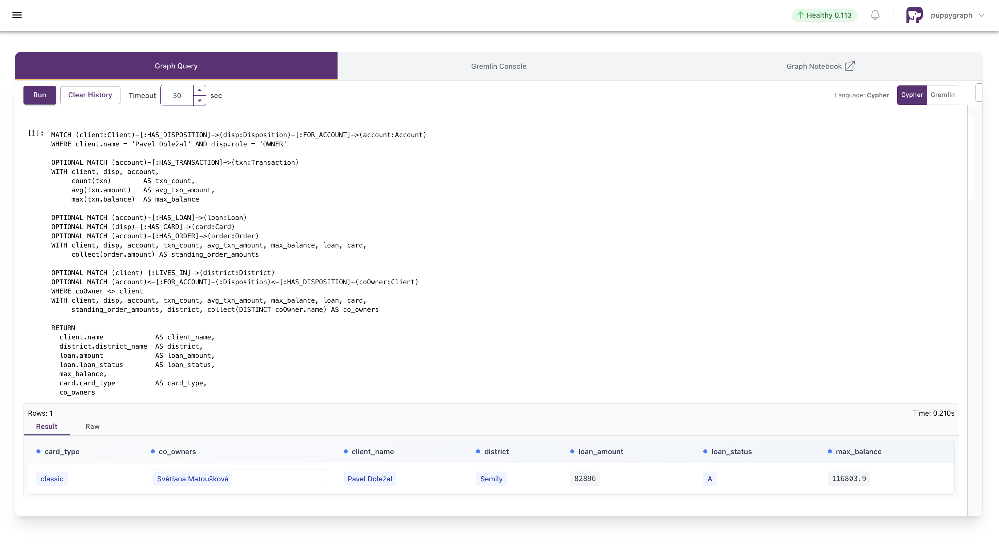
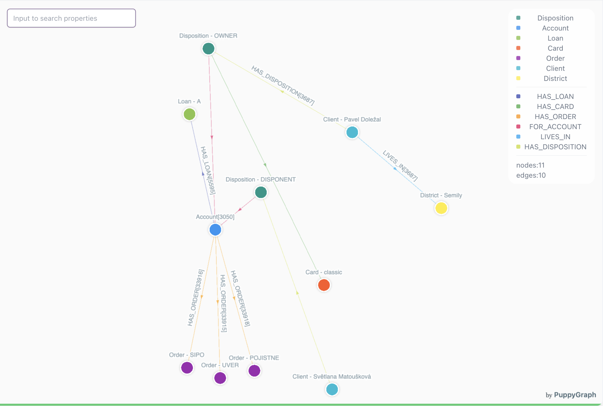
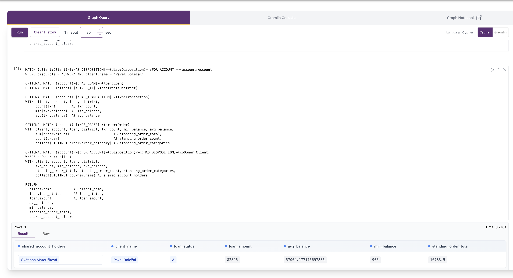
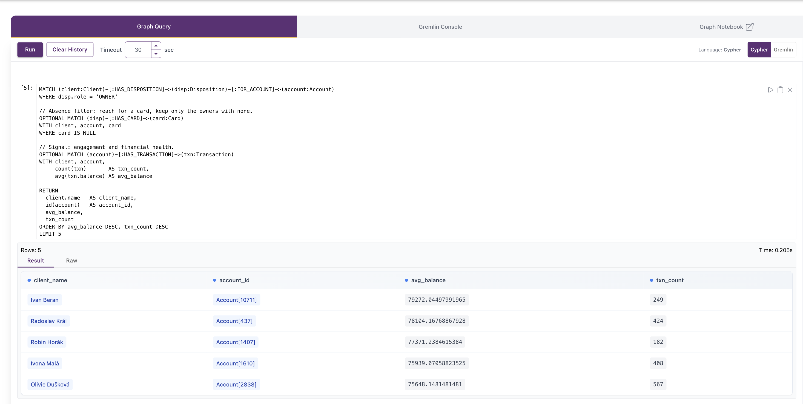

# Banking Customer 360 & Risk Analysis Demo

## Summary
This demo turns a relational banking dataset into a Customer 360 knowledge graph and
queries it with PuppyGraph, directly on Postgres, with no ETL. Starting from one
customer, the graph reaches their accounts, loans, cards, transactions, standing
orders, home district, and the other people who share their accounts, all in a single
traversal. Three queries put the same graph to three uses: a full customer view, a
loan risk-screening view, and a credit-card cross-sell list.

The data is the Berka dataset, a Czech bank's anonymized 1999 PKDD data: eight
relational tables covering clients, accounts, transactions, loans, cards, payment
orders, and district-level socioeconomics.

## The Berka Dataset
Berka is a fictionalized retail bank. Customers own or have access to accounts.
Accounts generate transactions, hold standing orders, and can carry a loan. Cards are
issued not to an account but to a specific customer-account relationship. Both
customers and accounts sit in districts that carry local demographic and economic
data.

The eight tables:

| Table       | What it is |
|-------------|------------|
| `client`    | A person. Berka has no names, so a synthetic `name` is added on load. |
| `account`   | A bank account. |
| `disp`      | A disposition: links a client to an account and records their role. |
| `trans`     | Account transactions (over 1 million rows). |
| `loan`      | A loan against an account, with its repayment outcome. |
| `card`      | A card issued against a disposition. |
| `orders`    | Standing payment instructions (recurring outgoing payments). |
| `district`  | Regional demographics and economics. |

Most of the categorical fields are Czech codes. The ones that matter for reading the
demo:

**Loan status (`loan.status`)** A and C are healthy, B and D are the problems:
| Code | Meaning |
|------|---------|
| A | Finished, fully paid |
| B | Finished, not paid (defaulted) |
| C | Running, no problems |
| D | Running, in debt |

**Disposition role (`disp.type`)**: `OWNER`, `DISPONENT`.
**Card type (`card.type`)**: `classic`, `junior`, `gold`.

**Payment purpose (`k_symbol`, on both `orders` and `trans`)**:
| Code | Meaning |
|------|---------|
| SIPO | Household payment |
| UVER | Loan payment |
| POJISTNE | Insurance |
| SLUZBY | Services / statement fee |
| UROK | Interest credited |
| DUCHOD | Pension |

Other encoded fields, used in the EDA but not surfaced in the demo queries (the
Transaction node exposes only `amount` and `balance`):
- **`trans.type`**: `PRIJEM` (money in), `VYDAJ` (money out), `VYBER` (withdrawal).
- **`trans.operation`**: `VKLAD` (cash deposit), `VYBER` (cash withdrawal), `VYBER KARTOU`
  (card withdrawal), `PREVOD NA UCET` (transfer out), `PREVOD Z UCTU` (transfer in).
- **`account.frequency`**: `POPLATEK MESICNE` (monthly), `POPLATEK TYDNE` (weekly),
  `POPLATEK PO OBRATU` (per transaction).

### Files
- `README.md`: this file.
- `docker-compose.yaml`: starts Postgres and PuppyGraph as containers.
- `load_data.py`: loads the Berka CSVs into Postgres.
- `schema.json`: maps the Postgres tables to a graph.
- `queries/`: the four Cypher queries.
- `assets/`: screenshots of the results.

## Prerequisites
- Docker and Docker Compose
- Python 3, with `pip install pandas sqlalchemy psycopg2-binary faker`

## Data Preparation
Download the Berka dataset from Kaggle:
```bash
curl -L -o the-berka-dataset.zip \
  https://www.kaggle.com/api/v1/datasets/download/marceloventura/the-berka-dataset
```
Unzip so the eight CSVs land in `./data`:
```bash
unzip the-berka-dataset.zip -d ./data
```
`load_data.py` reads from the path in its `data_dir` variable, so point that at the
CSVs.

## Deployment
```bash
docker compose up -d
```
This starts an empty `bank360` Postgres database and PuppyGraph on the same network.
The PuppyGraph UI is at `http://localhost:8081` (login `puppygraph` / `puppygraph123`).

## Data Import
With the containers up:
```bash
python load_data.py
```
The script loads all eight tables and does three cleanups the raw data needs:
- Renames `order` to `orders`, since `order` is reserved in SQL.
- Renames the district columns from `A1`..`A16` to readable names (`avg_salary`,
  `unemployment_rate_95`, and so on).
- Adds a synthetic Czech `name` to each client. Berka has no customer names, only
  IDs, so names are generated with Faker on a fixed seed (`Faker.seed(42)`) so they
  are the same on every run.

The script prints each table's row count as it loads. Those printed counts are the
source of truth for the numbers below.

## Modeling the Graph
Eight node types: **Client**, **Account**, **Disposition**, **Loan**, **Card**,
**Order**, **Transaction**, **District**. Each foreign key in the relational data
becomes an edge:

| Source foreign key      | Edge              |
|-------------------------|-------------------|
| `disp.client_id`        | `HAS_DISPOSITION` |
| `disp.account_id`       | `FOR_ACCOUNT`     |
| `trans.account_id`      | `HAS_TRANSACTION` |
| `loan.account_id`       | `HAS_LOAN`        |
| `card.disp_id`          | `HAS_CARD`        |
| `orders.account_id`     | `HAS_ORDER`       |
| `client.district_id`    | `LIVES_IN`        |
| `account.district_id`   | `OPENED_IN`       |

**Disposition is a node, not an edge, and that is the one call that matters.** A
disposition links a client to an account and records their role, owner or disponent.
It has to be a node because a card is issued against a specific disposition
(`card.disp_id` points at it), and you cannot attach a node to an edge. Making it a
node is also what lets one account carry two people, an owner and a disponent, which
the shared-account part of the queries relies on.

Upload `schema.json` through the PuppyGraph UI. PuppyGraph reads the Postgres tables
directly, so the graph is queryable as soon as the schema loads.

**Validation.** Before modeling, every foreign key was checked in pandas with a left
join plus an unmatched-row flag, not an inner join. An inner join silently drops
orphan rows, so it can hide a broken relationship; a left join with an indicator shows
the orphans instead. All child-to-parent checks came back with zero unmatched rows.
To confirm the graph mapping, run a count-per-label query in PuppyGraph and check each
node count against the table row count your load script printed.

## Querying the Graph
Open `http://localhost:8081`, go to **Graph Query**, set the language to **Cypher**.
The queries are in `queries/`.

### Choosing the demo subject: `queries/00_find_demo_subject.cypher`
This is a small graph query in its own right, and it is how the demo subject was
chosen rather than picked by hand. It walks every account that a client owns, then
uses `OPTIONAL MATCH` to check for a loan, a card, and any co-owner, and aggregates
the account's transactions into a count. Each account gets a `completeness` score from
0 to 3, one point each for having a loan, a card, and a co-owner, and the results are
ranked by that score and then by transaction volume.

It returns one row per owned account: `client_name`, `account_id`, `completeness`,
`has_loan`, `has_card`, `co_owner_count`, and `txn_count`. The top row is the richest
possible subject, and that is **Pavel Doležal** (account `3050`): he has a loan, a
card, a co-owner, and one of the heaviest transaction histories in the dataset. Every
query below runs on him.

### 1. Customer 360: `queries/01_customer_360.cypher`
One customer, everything, in a single traversal. The file has two versions.

The **table** version returns the customer's full profile in columns: their name and
district, their loan amount and status, their card, their balance figures, their
standing orders, and the other people on the account. It is the version to run when
you want to read or verify the exact values. For Pavel it comes back as one row: a
clean loan (status A) of 82,896, a classic card, a peak balance around 116,800, and
Světlana Matoušková as the co-owner, all in the Semily district.



The **visual** version returns nodes and relationships instead of columns, so
PuppyGraph draws the graph; run it in graph mode. This is the view that makes the
point: Pavel in the middle, with his account, loan, card, district, standing orders,
and co-owner all one or two hops away. Transactions are left out on purpose, since
hundreds of transaction nodes would bury the picture.



### 2. Underwriting: `queries/02_underwriting.cypher`
A loan risk-screening view. It pulls three signals off the account: own credit (loan
amount and status), liquidity (balance behaviour against recurring standing-order
commitments), and shared exposure (who else is on the account, since a loan and a
balance on a shared account are a joint liability). This is a screening view for a
human reviewer, not an automated decision. The data has no verified income and no
credit history, so it flags for review rather than approving or declining.



### 3. Cross-sell: `queries/03_cross_sell.cypher`
Finds credit-card candidates: owners with a product gap and the evidence to back it
up, active and financially healthy but with no card yet. The graph-native move is
finding what is absent, reaching for a card and keeping only the owners who have none,
then ranking those by balance and activity.



## Limitations
- Berka is historical, anonymized 1999 data.
- Customer names are synthetic, generated for display only.
- There is no credit bureau score, and no mortgage or investment products.
- The recommendations here are illustrative, not real lending or marketing decisions.
- Every client in this dataset belongs to exactly one account. So a multi-hop
  "connected to a defaulter through another account" analysis has nothing to traverse
  to here. The underwriting view uses shared-account co-ownership instead, which the
  data does support. On real multi-account data, the deeper connected-risk traversal
  is where a graph pulls further ahead of SQL.

## Cleanup and Teardown
```bash
docker compose down
```