#  Network Topology Demo

## Summary
Using PuppyGraph in this demo, we dynamically trace and display the network pathways from specific server nodes to downstream load balancers, 
including scenarios involving failed nodes. 

This visualization aids in rapid identification of critical points and potential vulnerabilities, enhancing network security management and response strategies.

## Prerequisites:
- Docker
- Docker Compose

## Deployment
- Run the following command to start the Apache Iceberg services and PuppyGraph:
```bash
docker compose up -d
```
Example output:
```bash
[+] Running 6/6
✔ Network puppy-iceberg         Created
✔ Container minio               Started
✔ Container mc                  Started
✔ Container iceberg-rest        Started
✔ Container spark-iceberg       Started
✔ Container puppygraph          Started
```

## Data Preparation
- Start the Spark-SQL shell to access Iceberg by running:
```bash
sudo docker exec -it spark-iceberg spark-sql
```
The shell prompt will appear as:
```shell
spark-sql ()>
```

- Execute the following SQL statements in the shell to create tables and import data:
```sql
CREATE DATABASE netdb;

CREATE EXTERNAL TABLE netdb.loadbalancer (
  id BIGINT,
  name STRING,
  IP STRING
) USING iceberg;

CREATE EXTERNAL TABLE netdb.servicenode (
  id BIGINT,
  name STRING,
  IP STRING,
  CPU DOUBLE,
  Mem DOUBLE,
  Disk DOUBLE,
  status STRING,
  balancerId BIGINT
) USING iceberg;

CREATE EXTERNAL TABLE netdb.request (
  id BIGINT,
  name STRING,
  nodeId BIGINT,
  balancerId BIGINT
) USING iceberg;

CREATE EXTERNAL TABLE netdb.distribute (
  id BIGINT,
  name STRING,
  balancerId BIGINT,
  nodeId BIGINT
) USING iceberg;

INSERT INTO netdb.loadbalancer 
SELECT * FROM parquet.`/parquet_data/loadbalancer.parquet`;

INSERT INTO netdb.servicenode 
SELECT * FROM parquet.`/parquet_data/servicenode.parquet`;

INSERT INTO netdb.request 
SELECT * FROM parquet.`/parquet_data/request.parquet`;

INSERT INTO netdb.distribute 
SELECT * FROM parquet.`/parquet_data/distribute.parquet`;

```
- Exit the Spark-SQL shell:
```sql
quit;
```

## Modeling the Graph
- Log into PuppyGraph Web UI at http://localhost:8081 with username `puppygraph` and password `puppygraph123`.

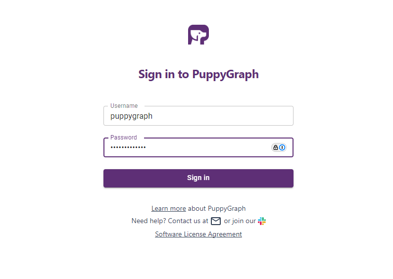

- Create Graph Schema

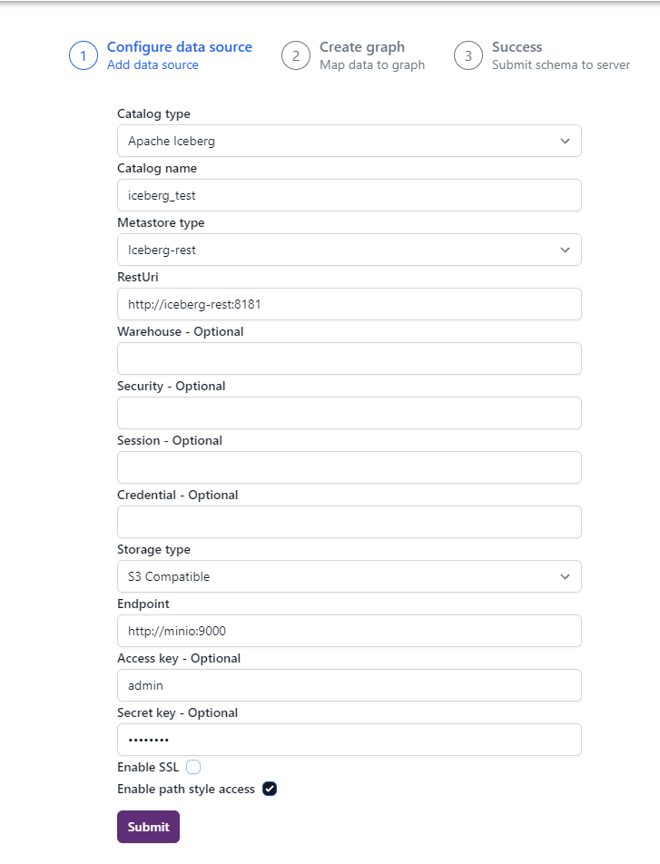

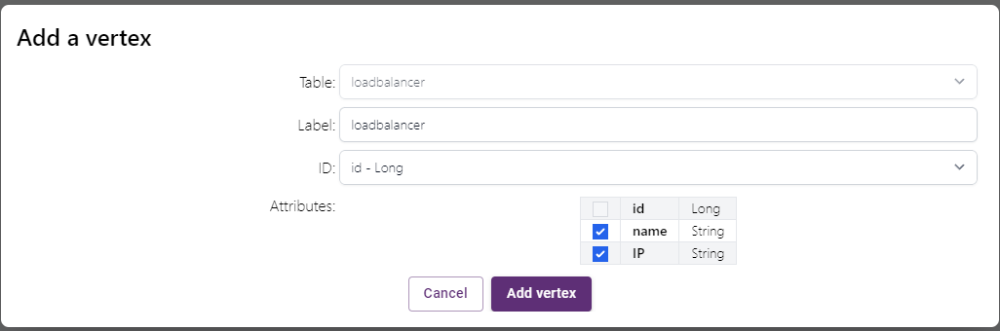

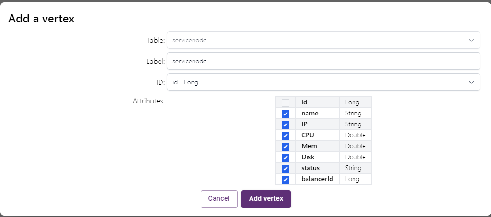

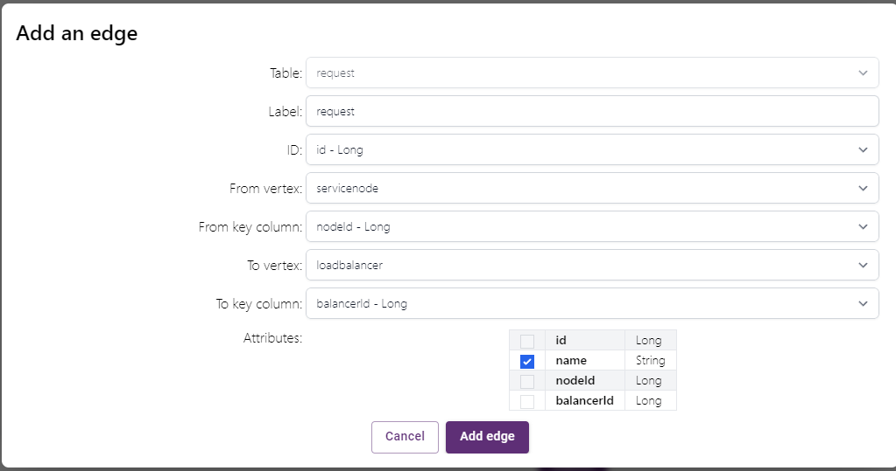

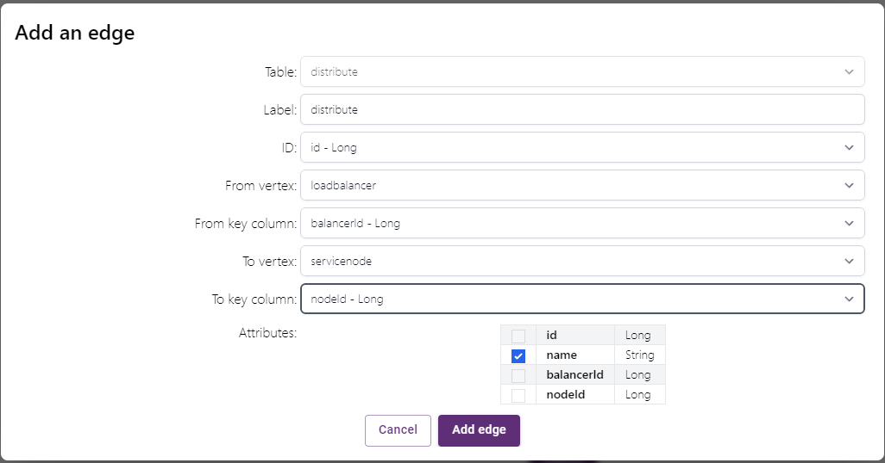

- Once the graph is created, the schema page displays the visualized graph schema as follows

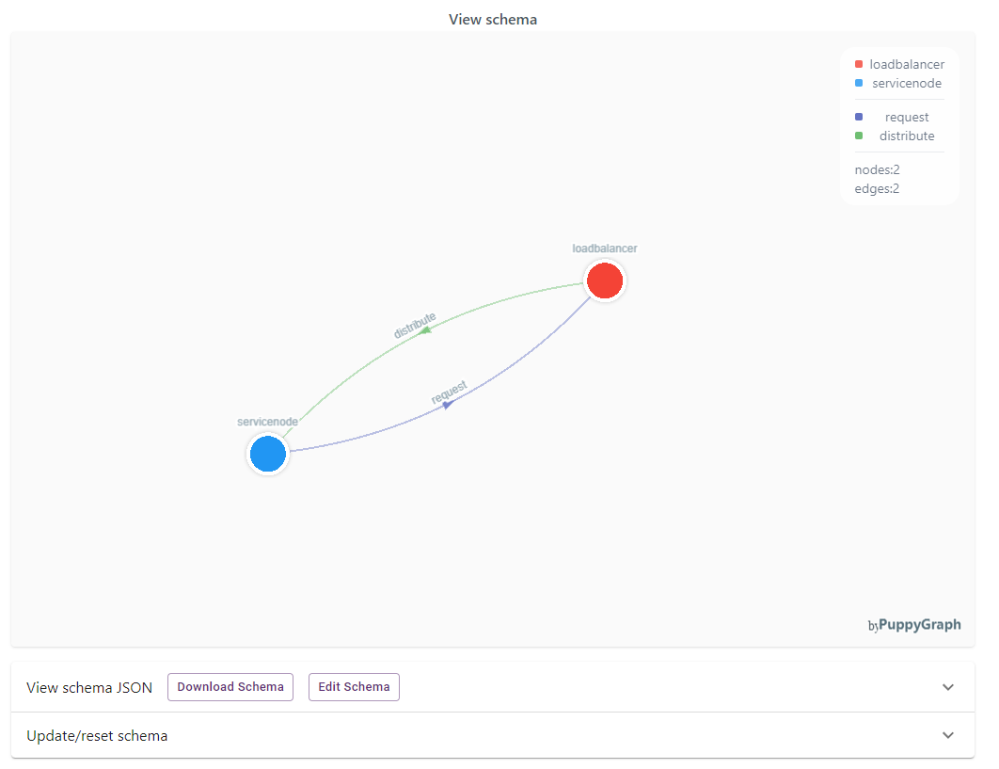

## Querying the Graph

- Click on the Query panel on the left side. The Gremlin Query tab offers an interactive environment for querying the graph using Gremlin.

1. Query the number of load balancers
```gremlin
g.V().hasLabel('loadbalancer').count()
```

2. Query the number of service nodes
```gremlin
g.V().hasLabel('servicenode').count()
```

3. Query service nodes with failed status
```gremlin
g.V().hasLabel('servicenode').has('status', 'failed')
```
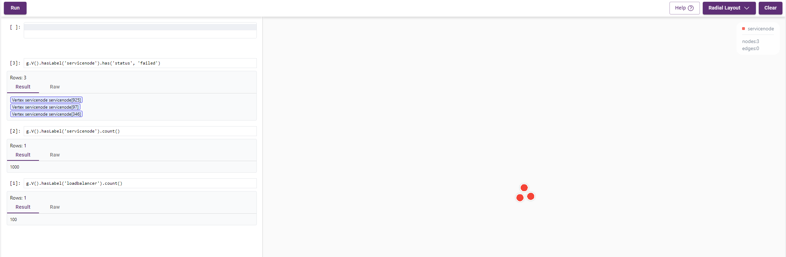

4. Query paths from a specific service node to all downstream load balancers and service nodes
   - Clear the visualized graph of the query results.
   - Run the following query:
```gremlin
g.V('servicenode[4]')
  .emit()
  .repeat(out('request','distribute').simplePath()).path()
  .order().by({ it.size() }, desc)
```
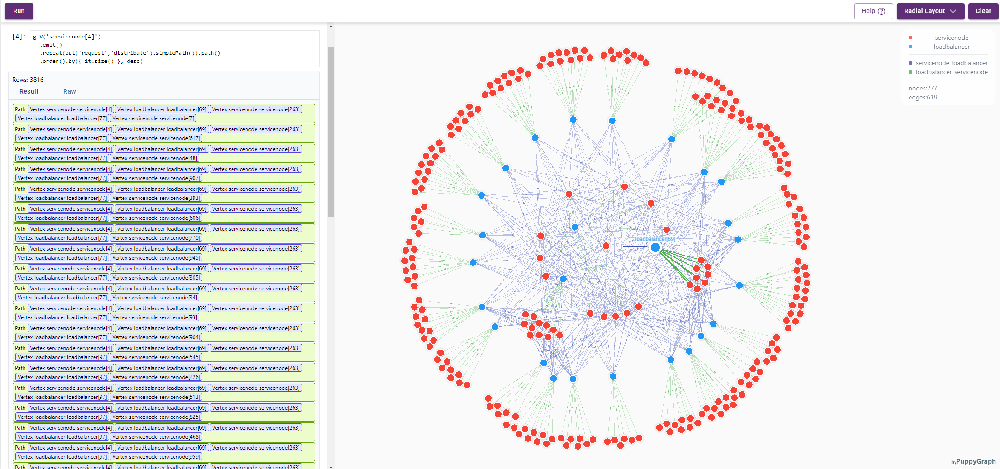

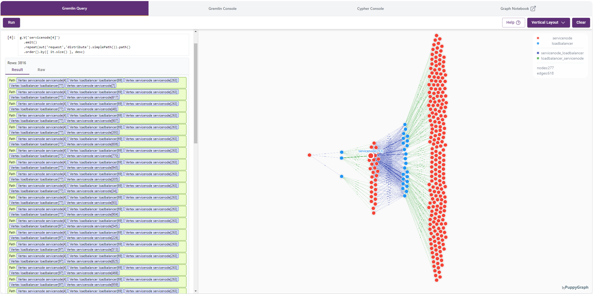

5. Clear panel and Query the paths from failed server node to all downstream load balancers.
   - Clear the visualized graph of the query results.
   - Run the following query:
```gremlin
g.V().hasLabel('servicenode').has('status', 'failed')
  .emit()
  .repeat(out('request', 'distribute').simplePath())
  .times(3)
  .path()
```
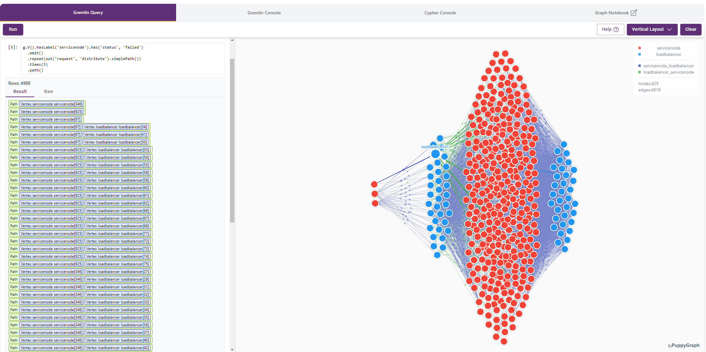

## Cleanup and Teardown
- To stop and remove the containers, networks, and volumes, run:
```bash
docker compose down --volumes --remove-orphans
```
