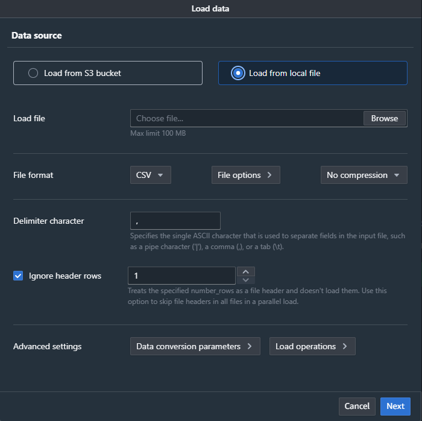
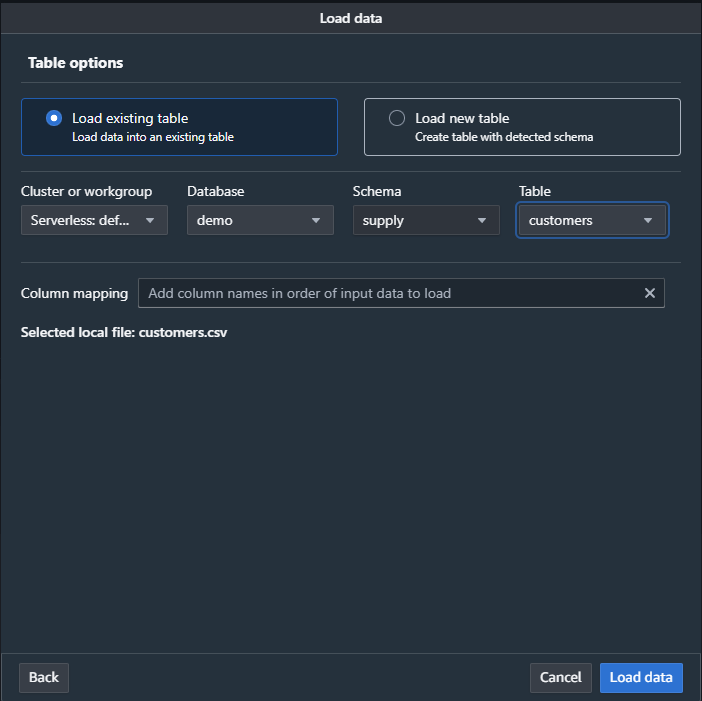

#  Optimizing Supply Chain Logistics Demo

## Summary
In this demo, PuppyGraph navigates a complex supply chain to optimize logistics and sales performance.  
We illustrate how to identify top-selling products and verify their inventory status, ensuring they are adequately stocked.  
Additionally, the demo addresses products with no sales, providing insights into potential market adjustments.  
It also showcases strategic reallocation of resources, offering solutions for transferring necessary parts from the nearest inventory when they are urgently needed at specific locations.  
This holistic view facilitates efficient management of supply and demand within the supply chain.

- **`README.md`**: Provides an overview of the project, including setup instructions and key details about the demo.
- **`csv_data/`**: Contains randomly generated CSV files representing customer orders, product inventories, materials, and locations.
                   These files are directly inserted into Amazon Redshift to model the supply chain's operations and logistical network, enabling data analysis and optimization.

## Prerequisites:
- Docker
- Docker Compose

## Note:
The following Data Preparation step populate example data for this demo.
For real-world applications, you can connect PuppyGraph directly to your existing Redshift, enabling seamless integration for real-time supply chain analytics, bypassing the need for these steps.

## Demo Data Preparation
1. Log in to Amazon Redshift Query Editor v2
2. Create Schema:
- Create a new schema (`supply`).
3. Execute the following SQL commands to create tables:
```sql
CREATE TABLE supply.customers (
    id bigint ENCODE az64,
    customername character varying(64) ENCODE lzo,
    city character varying(64) ENCODE lzo,
    state character varying(64) ENCODE lzo,
    location_id bigint ENCODE az64
) DISTSTYLE AUTO;

CREATE TABLE supply.distance (
    id bigint ENCODE az64,
    from_loc_id bigint ENCODE az64,
    to_loc_id bigint ENCODE az64,
    distance double precision ENCODE raw
) DISTSTYLE AUTO;

CREATE TABLE supply.factory (
    id bigint ENCODE az64,
    factoryname character varying(64) ENCODE lzo,
    locationid bigint ENCODE az64
) DISTSTYLE AUTO;

CREATE TABLE supply.inventory (
    id bigint ENCODE az64,
    productid bigint ENCODE az64,
    locationid bigint ENCODE az64,
    quantity integer ENCODE az64,
    lastupdated timestamp without time zone ENCODE az64,
    status character varying(20) ENCODE lzo
) DISTSTYLE AUTO;

CREATE TABLE supply.locations (
    id bigint ENCODE az64,
    address character varying(256) ENCODE lzo,
    city character varying(64) ENCODE lzo,
    country character varying(64) ENCODE lzo,
    lat double precision ENCODE raw,
    lng double precision ENCODE raw
) DISTSTYLE AUTO;
    
CREATE TABLE supply.materialfactory (
    id bigint ENCODE az64,
    material_id bigint ENCODE az64,
    factory_id bigint ENCODE az64
) DISTSTYLE AUTO;
    
CREATE TABLE supply.materialinventory (
    id bigint ENCODE az64,
    materialid bigint ENCODE az64,
    locationid bigint ENCODE az64,
    quantity bigint ENCODE az64,
    lastupdated timestamp without time zone ENCODE az64,
    status character varying(20) ENCODE lzo
) DISTSTYLE AUTO;

CREATE TABLE supply.materialorders (
    id bigint ENCODE az64,
    materialid bigint ENCODE az64,
    factoryid bigint ENCODE az64,
    quantity bigint ENCODE az64,
    orderdate timestamp without time zone ENCODE az64,
    expectedarrivaldate timestamp without time zone ENCODE az64,
    status character varying(32) ENCODE lzo
) DISTSTYLE AUTO;

CREATE TABLE supply.materials (
    id bigint ENCODE az64,
    materialname character varying(64) ENCODE lzo
) DISTSTYLE AUTO;

CREATE TABLE supply.productcomposition (
    id bigint ENCODE az64,
    productid bigint ENCODE az64,
    materialid bigint ENCODE az64,
    quantity bigint ENCODE az64
) DISTSTYLE AUTO;

CREATE TABLE supply.products (
    id bigint ENCODE az64,
    productname character varying(64) ENCODE lzo,
    price double precision ENCODE raw
) DISTSTYLE AUTO;

CREATE TABLE supply.productsales (
    id bigint ENCODE az64,
    productid bigint ENCODE az64,
    customerid bigint ENCODE az64,
    quantity bigint ENCODE az64,
    saledate timestamp without time zone ENCODE az64,
    totalprice double precision ENCODE raw
) DISTSTYLE AUTO;

CREATE TABLE supply.productshipment (
    id bigint ENCODE az64,
    productid bigint ENCODE az64,
    fromlocationid bigint ENCODE az64,
    tolocationid bigint ENCODE az64,
    quantity bigint ENCODE az64,
    shipmentdate timestamp without time zone ENCODE az64,
    expectedarrivaldate timestamp without time zone ENCODE az64,
    status character varying(32) ENCODE lzo
) DISTSTYLE AUTO;

```
4. Import CSV Data:
- Use the "Load data" feature in Redshift Query Editor v2 to load the CSV data into the respective tables.



## Modeling the Graph
1. Start the PuppyGraph:
```bash
sudo docker run -p 8080:8080 -p 8081:8081 -p 8182:8182 -p 7687:7687 -d --name puppy --rm puppygraph/puppygraph:stable
```

2. Log into the PuppyGraph Web UI at http://localhost:8081 with the following credentials:
- Username: `puppygraph`
- Password: `puppygraph123`

3. Update `schema.json` with Redshift Credentials
- Replace the `username`, `password` and `jdbcUri` fields in the `schema.json` file with your Redshift credentials.

4. Upload the schema:
- Select the file `schema.json` in the Upload Graph Schema JSON section and click on Upload.

## Querying the Graph

- Navigate to the Query panel on the left side. The **Graph Query** tab offers an interactive environment for querying the graph using Gremlin and openCypher.
- After each query, remember to clear the graph panel before executing the next query to maintain a clean visualization. You can do this by clicking the "Clear" button located in the top-right corner of the page.

Example Queries:
1. Query the top 5 best-selling products.
```gremlin
g.V().hasLabel('ProductOrder').as('order')
  .group().by('productid').by(__.values('quantity').sum()).as('sales')
  .order(local).by(values, desc)
  .unfold()
  .limit(5)
  .project('productid', 'total_sales')
    .by(keys)
    .by(values)
```

2. Query the 5 worst selling products.
```gremlin
g.V().hasLabel('ProductOrder').as('order')
  .group().by('productid').by(__.values('quantity').sum()).as('sales')
  .order(local).by(values, asc)
  .unfold()
  .limit(5)
  .project('productid', 'total_sales')
    .by(keys)
    .by(values)
```

3. Query the orders for the best-selling products and their materials, as well as whether the inventory is sufficient.
```gremlin
g.V("Product[88]").as('product')
  .union(
    __.out('ProductInventory').out('InventoryLocation').path(),
    __.in('ProOrderToPro').path(),
    __.out('ProductComposition').out('MaterialInventory').out('MatInventoryLocation').path(),
    __.out('ProductComposition').in('MatOrderToMat').out('MatOrderToFac').out('FactoryLocation').path()
  )
```

4. Query the path from a specific customer's orders through the products, their compositions, 
   the material orders, the factories producing those materials, and finally to the locations of those factories.
```gremlin
g.V("Customer[179]")
  .in('ProOrderToCus')
  .out('ProOrderToPro')
  .out('ProductComposition')
  .in('MatOrderToMat')
  .out('MatOrderToFac')
  .out('FactoryLocation')
  .path()
```

5. Query the distance between the product warehouse and customers, and sort them in descending order of proximity.
```gremlin
g.V("Product[88]")
  .out('ProductInventory').as('inventory')
  .out('InventoryLocation').as('inventoryLocation')
  .outE('Distance').as('distanceEdge')
  .inV().hasLabel('Location').as('location')
  .in('CustomerLocation').has('customername', 'Customer 179').as('customer')
  .select('distanceEdge')
  .order().by('distance')
  .path()
```

## Cleanup and Teardown
- To stop and remove the PuppyGraph container:
```bash
sudo docker stop puppy
```
