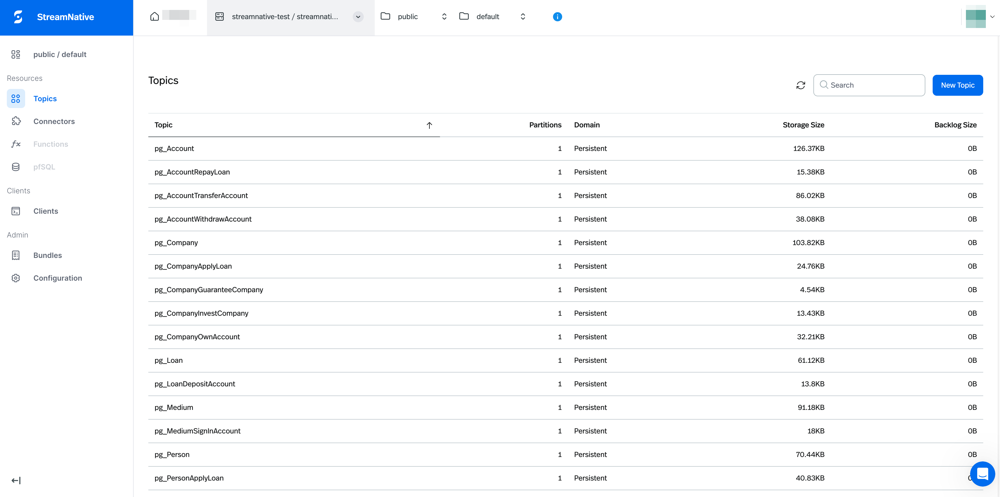
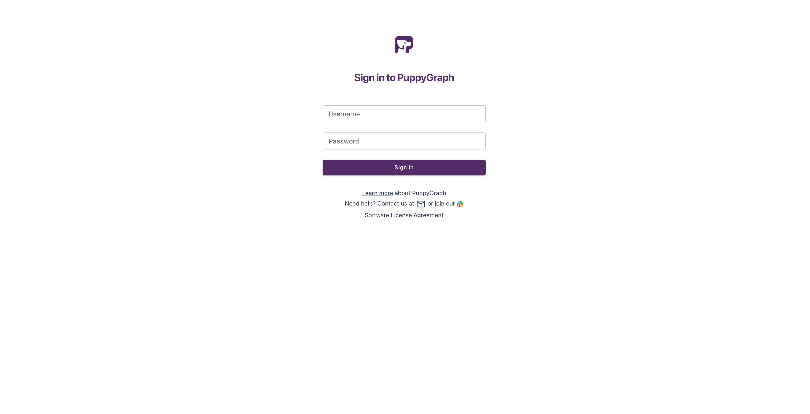
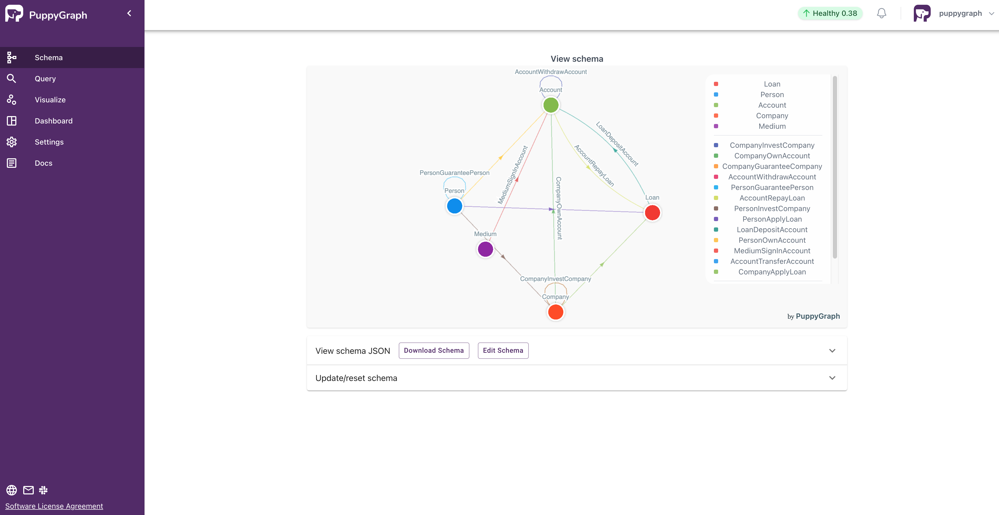
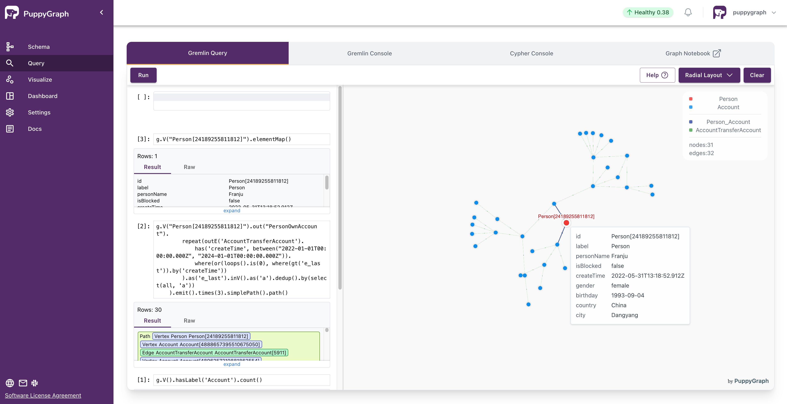

## Demo: Integrating StreamNative's Ursa Cluster with PuppyGraph

## Summary
This demo showcases real-time analysis by integrating StreamNative's Ursa cluster with PuppyGraph. We begin by deploying an Ursa cluster and producing stock data. After setting up Unity Catalog to manage the compacted data (data optimized for efficient querying), we deploy PuppyGraph and connect it to this data source. Finally, we update incremental data and observe the changes reflected in PuppyGraph in real-time.

* **`README.md`:**  This file! It provides an overview of the project, setup instructions, and key details.
* **`data`:** Contains the datasets used in the demo.
    * `stock_data.json`: Initial stock data for import.
    * `incremental_data.json`: Data for simulating a real-time stream.
* **`import_data.py`:** A Python script to import data into the system. Use the `-s` option to import stock data and `-i` for incremental data.
* **`create_table.sql`:** A SQL script to create table using the compacted data. It is used to set up Unity Catalog in Databricks for the compacted data.
* **`graph_schema.json`:** The graph schema of the compacted data for PuppyGraph.


## Prerequisites

Before running this demo, ensure you have the following:

* **AWS Account:**  You'll access to your AWS account for provisioning the [BYOC infrastructure](https://docs.streamnative.io/docs/byoc-overview).
* **Docker:** To run PuppyGraph docker container.
* **Python 3.7+:**  Ensure you have Python 3.7 or higher installed.
* **Python Packages:** Install the necessary Python packages using `pip`:
```bash
pip install confluent-kafka
```
* **Databricks Account:** In this demo, we will use Unity Catalog. Feel free to use [other choices](https://docs.puppygraph.com/connecting/connecting-to-delta-lake/).

## Deploying Your StreamNative Ursa Cluster

For deploying Ursa Cluster, follow the official [getting started guide](https://docs.streamnative.io/docs/quickstart-ursa) up to step 8. You can skip the Java and Maven prerequisites for this demo.

We also list the steps here.
1. Sign up
2. Grant StreamNative Vendor Access
3. Create a Cloud Connection
4. Create a Cloud Environment
5. Create a StreamNative Instance & Cluster
6. Create a service account
7. Create Tenant and Namespace, and Authorize the Service Account 
8. Grant permission to access Kafka Schema Registry

Note for step 7:
    This demo uses the default namespace public.default for data production, so you don't have to create new tenant and namespace.


## Producing the Stack Data

In script `import_data.py`, replace `<server_url>`, `<schema_registry_url>` with the actual values. You can see them in the `Details` tab of your cluster in StreamNative Cloud Console.
Also Replace `<jwt_token>` with the API key of your service account.

<figure style="width: 90%;">
  
  <figcaption> </figcaption>
</figure>

Run the script `import_data.py` with option `-s` to produce the stack data.
```bash
python import_data.py -s
```

Now if you access StreamNative Cloud Console, you can see the topics.

<figure style="width: 90%;">
  
  <figcaption> </figcaption>
</figure>

## Set up Unity Catalog for Compacted Data

After producing the stock data, allow approximately 1 to 2 minutes for the compaction process to complete. The compacted data will then appear in your AWS S3 bucket at the s3 URI you configured in the previous section. The s3 URI may look like `s3://aws-xxxx-xxxx-gamvt-tiered-storage-snc/xxxx-xxxx-xxxx-ursa/compaction/`. 

Now you can go to Databricks console and set up [Unity Catalog](https://docs.databricks.com/en/data-governance/unity-catalog/index.html#setup). 
The table format of compacted data is delta lake. 
Under you Unity catalog, add schema for the compacted data.

In `create_table.sql`, replace all occurrences of  `<s3 URI for the compaction>` with the actual value.
Then copy the sql in `create_table.sql` into SQL Editor of Databricks and run it.
Once completed, you can check the compacted data by running SQL queries like 
```SQL
SELECT count(*) FROM account;
```

<figure style="width: 90%;">
  
  <figcaption> </figcaption>
</figure>

<figure style="width: 90%;">
  
  <figcaption> </figcaption>
</figure>

<figure style="width: 90%;">
  
  <figcaption> </figcaption>
</figure>

## Deploying PuppyGraph

Run the following command to launch the PuppyGraph container. 

```bash
docker run -p 8081:8081 -p 8182:8182 -p 7687:7687 -e DATAACCESS_DATA_CACHE_STRATEGY=adaptive -d --name puppy --rm --pull=always puppygraph/puppygraph:stable
```

Open your browser and navigate to localhost:8081 (or your instance's URL) to access the PuppyGraph login screen. Log into the PuppyGraph Web UI with the following credentials:
- Username: `puppygraph`
- Password: `puppygraph123`

<figure style="width: 80%;">
  
  <figcaption> </figcaption>
</figure>

## Connecting to the Compacted Data
To connect PuppyGraph to the compacted data, you need to define the graph schema. You can use PuppyGraph's Web UI to do that, adding the vertices and edges manually through the interface, or compose the JSON schema file and upload it to PuppyGraph. The file `graph_schema.json` is ready for you to use.

<figure style="width: 80%;">
  
  <figcaption> </figcaption>
</figure>

In `graph_schema.json`, replace all occurrences of `<Databricks catalog name>`, `<Databricks host>`, `<Databricks token>`, `<Region>`, `<Access key>`, `<Secret key>`, `<schema name>` with the actual values. For details about these fields, refer to the PuppyGraph 
[connecting document](https://docs.puppygraph.com/connecting/connecting-to-delta-lake/).

In Web UI, select the file `schema.json` in the `Upload Graph Schema JSON` section and click on Upload.

<figure style="width: 80%;">
  
  <figcaption> </figcaption>
</figure>

## Query the graph
You can try some [Gremlin or Cypher queries](https://docs.puppygraph.com/querying/) of the stack data for PuppyGraph.
- Navigate to the Query panel on the left side. The Gremlin Query tab offers an interactive environment for querying the graph using Gremlin.
- After each query, remember to clear the graph panel before executing the next query to maintain a clean visualization. You can do this by clicking the "Clear" button located in the top-right corner of the page.
- For Cypher queries, you can use [Graph Notebook and Cypher Console](https://docs.puppygraph.com/querying/querying-using-opencypher/). Be sure to add `:>` before the cypher query when using Cypher Console. 

Some example queries:
1. Gremlin query: Get the number of accounts.
    ```groovy
    g.V().hasLabel('Account').count()
    ```
2. Gremlin query: Get the accounts which are blocked.
    ```groovy
    g.V().has('Account', 'isBlocked', true)
    ```
3. Given an account, find the sum and max of fund amount in transfer-ins and transfer-outs between them in a specific time range between startTime and endTime.
   ```groovy
    g.V("Account[268245652805255366]").as('v').
        project('outs', 'ins').
            by(select('v').outE('AccountTransferAccount').has('createTime', between("2022-01-01T00:00:00.000Z", "2024-01-01T00:00:00.000Z")).fold()).
            by(select('v').inE('AccountTransferAccount').has('createTime', between("2022-01-01T00:00:00.000Z", "2024-01-01T00:00:00.000Z")).fold()).
        project('sumOutEdgeAmount', 'maxOutEdgeAmount', 'numOutEdge', 
        'sumInEdgeAmount', 'maxInEdgeAmount', 'numInEdge').
            by(select('outs').coalesce(unfold().values('amount').sum(), constant(0))).
            by(select('outs').coalesce(unfold().values('amount').max(), constant(-1))).
            by(select('outs').coalesce(unfold().count(), constant(0))).
            by(select('ins').coalesce(unfold().values('amount').sum(), constant(0))).
            by(select('ins').coalesce(unfold().values('amount').max(), constant(-1))).
            by(select('ins').coalesce(unfold().count(), constant(0)))
   ```
4. Given a person and a specified time window between startTime and endTime, find the transfer trace from the account owned by the person to another account by at most 3 steps. Note that the trace must be in ascending order (only greater than) of their timestamps. Return all the
transfer traces.
    ```groovy
    g.V("Person[24189255811812]").out("PersonOwnAccount").
        repeat(outE('AccountTransferAccount').
            has('createTime', between("2022-01-01T00:00:00.000Z", "2024-01-01T00:00:00.000Z")).
            where(or(loops().is(0), where(gt('e_last')).by('createTime'))  
        ).as('e_last').inV().as('a').dedup().by(select(all, 'a'))
    ).emit().times(3).simplePath().path()
    ```
5. Cypher query: Get the number of accounts.
   ```cypher
   MATCH (x:Account) RETURN count(x)
   ```

Note: 
 Example queries 3 and 4 will return `null` for stack data because those vertices will be imported in the incremental data.

<figure style="width: 80%;">
  
  <figcaption> </figcaption>
</figure>

## Producing the Incremental Data

Run the script `import_data.py` with option `-i` to produce the stack data.
```bash
python import_data.py -i
```

You can try SQL queries in Databricks and Gremlin or Cypher queries in PuppyGraph regularly and observe changes in the results. New results are available approximately every 1 to 2 minutes.

<figure style="width: 40%;">
  
  <figcaption>Results of example query 1 at different times.</figcaption>
</figure>

<figure style="width: 90%;">
  
  <figcaption>Final result of example query 4 with graph visualization.</figcaption>
</figure>