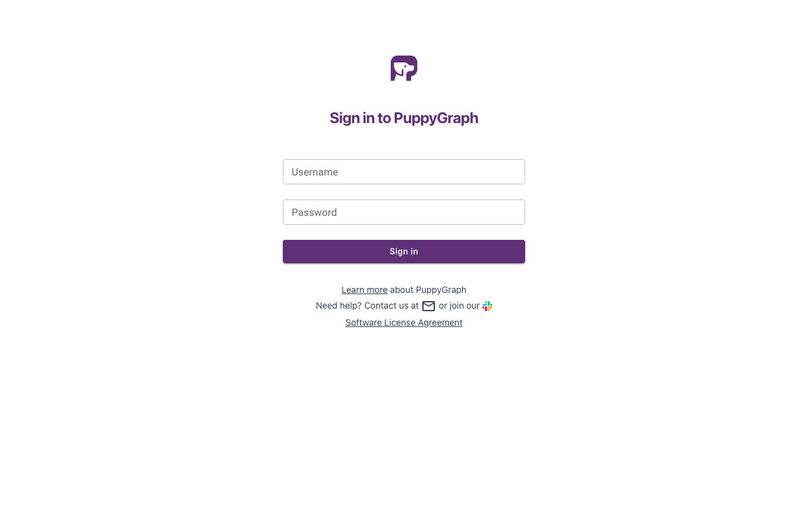
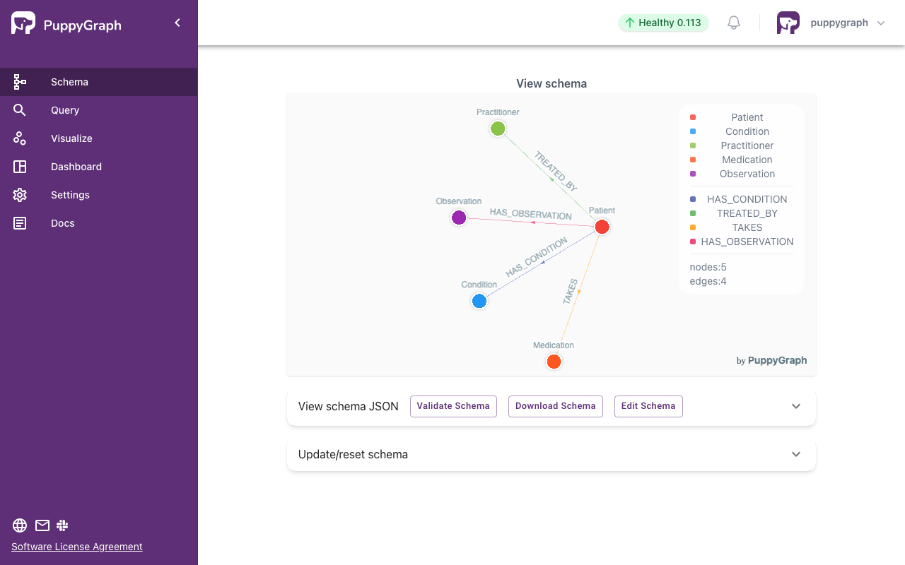
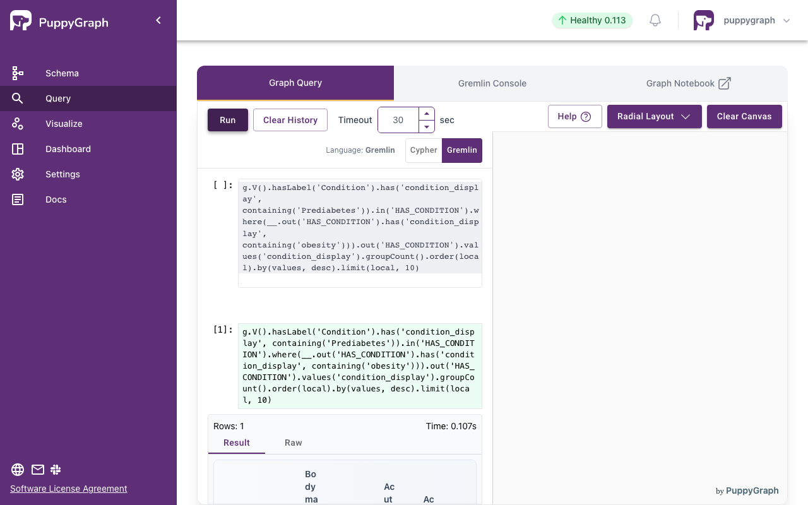

# Synthea FHIR Knowledge Graph Demo

## The Challenge in Clinical Analytics
Healthcare data is naturally interconnected. A single patient record connects to numerous conditions, observations, medications, and practitioners. For medical researchers and clinical analysts, discovering patterns in this data is critical. For example, a researcher might want to ask: "Find all patients with Prediabetes and Obesity, and show me what other conditions they develop."

Answering this question with traditional SQL on flattened FHIR data requires multiple self-joins. Every new condition you look for adds another join. For a patient with 20 conditions, three self-joins can produce thousands of intermediate rows before filtering, causing massive performance bottlenecks and cartesian row explosions.

## The Solution: Querying as a Graph
This demo shows how to solve this problem using PuppyGraph and DuckDB. By querying the data as a graph:
1. **Natural Fit:** FHIR references are inherently graph edges. PuppyGraph natively exposes these relationships.
2. **No Row Explosions:** Complex chains like Patient -> Condition -> Observation become simple graph walks instead of heavy SQL joins.
3. **No Database Migration:** PuppyGraph reads your existing Parquet files directly via DuckDB. There is no need to extract, transform, and load your data into a separate graph database.

This repository provides a complete pipeline to convert synthetic patient records (Synthea FHIR R4 bundles) into a property graph that researchers can explore visually and analytically.

## Prerequisites
1. Python 3.10+
2. Docker and Docker Compose

## Note
The steps below use publicly available synthetic patient data from Synthea. If no local Synthea data is found, the script automatically downloads a sample dataset from Synthea's public releases.

## Demo Data Preparation
Create a virtual environment, install dependencies, and run the data generator:
```bash
python3 -m venv .venv
source .venv/bin/activate
pip install -r requirements.txt
python Dataset_generator.py
```

This pipeline automatically:
1. Parses FHIR JSON bundles
2. Flattens Patient, Condition, Observation, Practitioner, and Medication resources
3. Writes Parquet files to the `puppygraph_output/` folder
4. Creates a DuckDB database providing a SQL interface to the Parquet files

## Deployment
Start PuppyGraph using Docker Compose:
```bash
docker compose up -d
```
Example output:
```bash
[+] Running 2/2
 ✔ Network synthea-fhir-knowledge-graph-demo_default  Created
 ✔ Container puppygraph                               Started
```

## Modeling the Graph
1. Log into the PuppyGraph Web UI at http://localhost:8081 with the following credentials:
   - Username: `puppygraph`
   - Password: `puppygraph123`



2. Navigate to the Schema tab, select `schema.json`, and click Upload.



## Analyzing Comorbidities
Navigate to the **Query** panel to see the graph in action. The power of the graph approach becomes clear when we compare SQL and Gremlin for our clinical research question.

**The Question:** Find all patients with Prediabetes and Obesity, then show their other conditions.

### Traditional SQL Approach
In SQL, this requires three self-joins on the conditions table. As you search for deeper patterns, the complexity and query time grow exponentially.

```sql
SELECT c3.condition_display, COUNT(*) AS cnt
FROM patients p
JOIN conditions c1 ON p.patient_id = c1.patient_id
JOIN conditions c2 ON p.patient_id = c2.patient_id
JOIN conditions c3 ON p.patient_id = c3.patient_id
WHERE c1.condition_display LIKE '%Prediabetes%'
  AND c2.condition_display LIKE '%obesity%'
  AND c3.condition_display NOT LIKE '%Prediabetes%'
GROUP BY c3.condition_display
ORDER BY cnt DESC
LIMIT 10;
```

### Graph Traversal Approach
In Gremlin, this is a single, intuitive traversal. Complexity does not scale with depth, making it ideal for researchers exploring deep clinical pathways.



```gremlin
g.V().hasLabel('Condition')
  .has('condition_display', containing('Prediabetes'))
  .in('HAS_CONDITION')
  .where(
    __.out('HAS_CONDITION')
      .has('condition_display', containing('obesity')))
  .out('HAS_CONDITION')
  .values('condition_display')
  .groupCount()
  .order(local).by(values, desc)
  .limit(local, 10)
```
## Cleanup and Teardown
To stop the services and clean up containers:
```bash
docker compose down --volumes --remove-orphans
```
